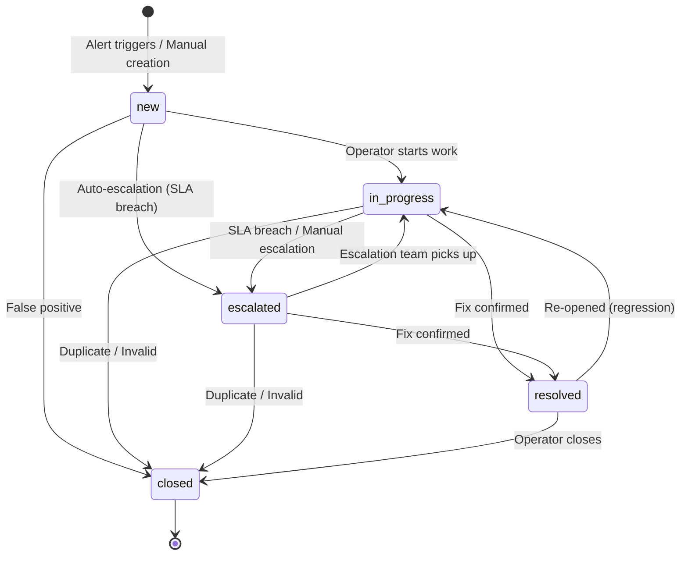

# Situational Center - Architecture & Operations Manual

## Table of Contents

- [1. System Overview](#1-system-overview)
- [2. C4 Architecture](#2-c4-architecture)
  - [2.1 Level 1 - System Context](#21-level-1---system-context)
  - [2.2 Level 2 - Container Diagram](#22-level-2---container-diagram)
  - [2.3 Level 3 - Component Diagram (API)](#23-level-3---component-diagram-api)
  - [2.4 Level 3 - Component Diagram (Workers)](#24-level-3---component-diagram-workers)
  - [2.5 Level 4 - Code (Data Models)](#25-level-4---code-data-models)
- [3. Data Models](#3-data-models)
  - [3.1 ER Diagram](#31-er-diagram)
  - [3.2 Database Tables](#32-database-tables)
  - [3.3 API Schemas (Pydantic)](#33-api-schemas-pydantic)
  - [3.4 Service DTOs (Dataclasses)](#34-service-dtos-dataclasses)
- [4. API Endpoints](#4-api-endpoints)
- [5. Periodic Tasks](#5-periodic-tasks)
- [6. Launch Manual](#6-launch-manual)
  - [6.1 Prerequisites](#61-prerequisites)
  - [6.2 Local Development (Minimal)](#62-local-development-minimal)
  - [6.3 Full Docker Compose](#63-full-docker-compose)
  - [6.4 High-Availability Setup](#64-high-availability-setup)
  - [6.5 Kubernetes (Helm)](#65-kubernetes-helm)
  - [6.6 Environment Variables Reference](#66-environment-variables-reference)
- [7. Network Topology & Ports](#7-network-topology--ports)

---

## 1. System Overview

Situational Center (Sit Center) is an enterprise-grade **decision support system (DSS)**
built on a monitoring & incident-management foundation. Beyond detecting problems, it
drives the full decision loop — Observe → Orient → Project → Decide → Act → Learn —
through indicators with target corridors, situation correlation, predictive alerts,
Next-Best-Action recommendations, executable processes, and a learning feedback loop.

> Decision-support layer: see **[DSS_TARGET_ARCHITECTURE.md](DSS_TARGET_ARCHITECTURE.md)**
> (architecture, 12 modules) and **[docs/dss-guide.md](docs/dss-guide.md)** (how to work).
> DSS schema = `db/migrations/010–017`; engines = `core/*_engine.py`; cockpit UI =
> `frontend/src/pages/Cockpit/`.

**Core capabilities:**
- Decision loop: indicator/corridor model, deviation+chronicle, situation correlation,
  predictive alerts, playbook recommendations (NBA), process engine, decision log + win-rate, what-if
- Ingest metrics from multiple sources (REST API, webhooks, Kafka)
- Time-series storage with TimescaleDB (hypertable with auto-chunking, compression, retention)
- ML-based anomaly detection (Prophet, LSTM, Isolation Forest, Clustering, ARIMA)
- Rule engine with PromQL-compatible syntax
- Real-time alerting via WebSocket, Telegram, and i-doit integration
- Incident lifecycle management with SLA policies and escalation chains
- Multi-tenant architecture with RBAC (local, LDAP, OIDC/Keycloak auth)
- OLAP analytics via ClickHouse (optional)
- High-availability deployment with nginx LB, Redis Sentinel, DB replication

**Tech stack:** Python 3.11, FastAPI, SQLAlchemy 2.0, Celery, TimescaleDB (PostgreSQL 15), Redis 7, Kafka, ClickHouse, Keycloak, Helm/Kubernetes.

---

## 2. C4 Architecture

### 2.1 Level 1 - System Context

Shows the Sit Center system boundaries and its external actors/systems.

```
+------------------+       +-------------------+       +------------------+
|    Operators     |       |  External Systems |       |   Identity       |
|  (Web Browser)   |       |                   |       |   Providers      |
+--------+---------+       +--------+----------+       +--------+---------+
         |                          |                           |
         | HTTPS/WSS               | HTTP/JSON-RPC             | LDAP/OIDC
         |                          |                           |
+--------v--------------------------v---------------------------v---------+
|                                                                         |
|                      SITUATIONAL CENTER                                 |
|                                                                         |
|  Collect metrics, detect anomalies, manage incidents,                   |
|  notify operators, enforce SLA policies                                 |
|                                                                         |
+--------+------------------+------------------+-------------------------+
         |                  |                  |
         | Telegram API     | JSON-RPC         | Prometheus scrape
         |                  |                  |
+--------v--------+ +-------v-------+ +-------v--------+
| Telegram Bot    | |    i-doit     | | Grafana        |
| (Notifications) | | (ITSM)        | | (Dashboards)   |
+-----------------+ +---------------+ +----------------+
```

**Actors:**
- **Operators** - monitoring engineers, incident managers, administrators
- **External Systems** - Grafana (webhooks), i-doit (ITSM bidirectional sync)
- **Identity Providers** - LDAP/Active Directory, Keycloak (OIDC SSO)

**External integrations:**
- **Telegram** - priority-based alert channels (info, warning, critical)
- **i-doit** - incident creation, status sync, escalation
- **Grafana** - dashboard visualization, alert forwarding
- **Prometheus** - metrics scraping from `/metric` endpoint

---

### 2.2 Level 2 - Container Diagram

Shows the major runtime containers and their interactions.

```
                            +-------------------+
                            |   Operators        |
                            |   (Browser)        |
                            +---------+---------+
                                      |
                              HTTPS / WSS
                                      |
          +---------------------------v---------------------------+
          |                     NGINX / Ingress                   |
          |                  (Load Balancer / TLS)                |
          +---+------------------+------------------+------------+
              |                  |                  |
              v                  v                  v
+-------------+--+ +------------+---+ +------------+---+
|  API Server    | |  API Server    | |  WebSocket     |
|  (FastAPI)     | |  (FastAPI)     | |  /ws/alerts    |
|  Port 8000     | |  Port 8000     | |  (same proc)   |
+-------+--------+ +-------+--------+ +-------+--------+
        |                   |                  |
        +----------+--------+-------+----------+
                   |                |
        +----------v--+    +-------v---------+
        | TimescaleDB  |    |     Redis       |
        | (PostgreSQL) |    | (Cache/Broker/  |
        | Port 5432    |    |  PubSub)        |
        +---------+----+    | Port 6379       |
                  |         +--+------+-------+
                  |            |      |
        +---------v----+  +---v------v-------+
        | ClickHouse   |  | Celery Workers   |
        | (OLAP, opt.) |  | (General Queue)  |
        | Port 8123    |  | - Alerts check   |
        +--------------+  | - SLA breach     |
                          | - MV update      |
                          | - Rule eval      |
                          +------------------+
                                   |
                          +--------v---------+
                          | ML Worker        |
                          | (ml queue)       |
                          | - Anomaly detect |
                          | - Model retrain  |
                          | Memory: 4GB      |
                          +------------------+

        +------------------+      +-----------------+
        | Kafka + Zookeeper|      | Celery Beat     |
        | (Streaming, opt.)|      | (Scheduler)     |
        | Port 9092        |      +-----------------+
        +--------+---------+
                 |
        +--------v---------+
        | Kafka Consumer   |
        | (Batch INSERT)   |
        +------------------+

        +------------------+      +-----------------+
        | Keycloak (SSO)   |      | Grafana         |
        | Port 8443        |      | Port 3000       |
        +------------------+      +-----------------+

        +------------------+
        | i-doit (ITSM)    |
        | Port 9080        |
        +------------------+
```

**Container descriptions:**

| Container | Technology | Purpose |
|-----------|-----------|---------|
| API Server | FastAPI + Uvicorn | REST API, WebSocket, Prometheus metrics, auth |
| TimescaleDB | PostgreSQL 15 + TimescaleDB | Primary OLTP storage, hypertable for metrics |
| Redis | Redis 7 Alpine | Celery broker, cache, Pub/Sub for alerts, DLQ |
| Celery Worker | Celery 5.3, prefork | Background task processing (general queue) |
| ML Worker | Celery 5.3, prefork | ML anomaly detection and model retraining (ml queue) |
| Celery Beat | Celery Beat | Periodic task scheduling (6 scheduled tasks) |
| ClickHouse | ClickHouse 23.8 | OLAP analytics for long-range queries (optional) |
| Kafka | Confluent Kafka 7.5 | High-throughput metric ingestion (optional) |
| Kafka Consumer | Python | Batch consumer: Kafka topic -> TimescaleDB |
| Keycloak | Keycloak 23.0 | OIDC/SSO identity provider (optional) |
| Grafana | Grafana latest | Monitoring dashboards |
| i-doit | bheisig/idoit 1.19 | ITSM / CMDB (bidirectional sync) |
| Nginx | Nginx 1.25 | Load balancer, TLS termination (HA mode) |
| Flower | Flower | Celery monitoring UI (port 5555) |

---

### 2.3 Level 3 - Component Diagram (API)

Internal components of the FastAPI API Server.

```
+------------------------------------------------------------------+
|                        API Server (FastAPI)                        |
|                                                                    |
|  +------------------+  +------------------+  +-----------------+   |
|  | Middleware Stack  |  | Auth Layer       |  | WebSocket       |   |
|  | - CORS           |  | - JWT (local)    |  | /ws/alerts      |   |
|  | - Session        |  | - LDAP           |  | Redis PubSub    |   |
|  | - Prometheus     |  | - OIDC callback  |  | subscriber      |   |
|  | - Deprecation    |  | - RBAC checks    |  +-----------------+   |
|  | - Rate Limiting  |  +------------------+                        |
|  +------------------+                                              |
|                                                                    |
|  +---------------------+  Routers (13 modules)                     |
|  |                     |                                           |
|  |  /metrics           |  CRUD for metric definitions              |
|  |  /dimensions        |  CRUD for dimension metadata              |
|  |  /rules             |  CRUD for alerting rules                  |
|  |  /ml/configs        |  CRUD for ML configurations               |
|  |  /alerts            |  Read alert events                        |
|  |  /data              |  Query metric data (Prometheus compat)    |
|  |  /webhooks          |  Grafana + i-doit ingest                  |
|  |  /admin             |  Tenant/user/role management              |
|  |  /incidents         |  Incident lifecycle + SLA + comments      |
|  |  /forecasts         |  ML-based metric forecasts                |
|  |  /auth              |  OIDC login/callback                      |
|  |  /audit             |  Audit log queries                        |
|  |  /ws/alerts         |  WebSocket real-time alerts               |
|  +---------------------+                                           |
|                                                                    |
|  +---------------------+  Services                                 |
|  |                     |                                           |
|  |  MetadataService    |  Metric/dimension/rule/ML config CRUD     |
|  |  AnalyticsService   |  ClickHouse OLAP queries                  |
|  |  SlaService         |  SLA policy evaluation                    |
|  |  IdoitService       |  i-doit JSON-RPC integration              |
|  |  AuditService       |  Audit logging                            |
|  |  AlertService       |  Alert lifecycle + notifications          |
|  |  TenantContext      |  Multi-tenant isolation                   |
|  +---------------------+                                           |
+------------------------------------------------------------------+
```

**Middleware execution order** (top to bottom):
1. `SessionMiddleware` - session management
2. `PrometheusMiddleware` - HTTP metrics + SQLAlchemy pool metrics
3. `DeprecationMiddleware` - legacy route deprecation headers
4. `SlowAPI (Rate Limiting)` - 5/min on `/token`, configurable per route
5. `CORSMiddleware` - cross-origin requests

**Authentication flow:**
1. LDAP authentication (if `LDAP_ENABLED=true`)
2. Database user authentication (bcrypt password check)
3. Environment admin fallback (`ADMIN_USERNAME` / `ADMIN_PASSWORD`)

**JWT payload:** `sub`, `tenant_id`, `roles[]`, `permissions[]`, `scopes[]`, `exp`

---

### 2.4 Level 3 - Component Diagram (Workers)

```
+------------------------------------------------------------------+
|                     Celery Workers (General)                       |
|                                                                    |
|  +---------------------+  +---------------------+                 |
|  | run_alerts_check    |  | send_notification   |                 |
|  | Growth alerts on    |  | Telegram dispatch   |                 |
|  | 1h / 6h / 24h      |  | with retry + DLQ    |                 |
|  +---------------------+  +---------------------+                 |
|                                                                    |
|  +---------------------+  +---------------------+                 |
|  | update_mv_data      |  | evaluate_rules_task |                 |
|  | Refresh materialized|  | PromQL rule engine  |                 |
|  | views               |  | evaluation          |                 |
|  +---------------------+  +---------------------+                 |
|                                                                    |
|  +---------------------+  +---------------------+                 |
|  | check_sla_breaches  |  | check_auto_escalate |                 |
|  | SLA deadline check  |  | Escalation chain    |                 |
|  +---------------------+  +---------------------+                 |
+------------------------------------------------------------------+

+------------------------------------------------------------------+
|                     ML Worker (Queue: ml)                          |
|                     Memory limit: 4GB                              |
|                     Concurrency: 1                                 |
|                     Max tasks per child: 10                        |
|                                                                    |
|  +---------------------+  +---------------------+                 |
|  | run_ml_anomaly_check|  | retrain_ml_models   |                 |
|  | Prophet, LSTM,      |  | TensorFlow, PyTorch |                 |
|  | Isolation Forest,   |  | model retraining    |                 |
|  | Clustering, ARIMA   |  | Daily at 03:00 UTC  |                 |
|  | time_limit: 600s    |  | time_limit: 600s    |                 |
|  +---------------------+  +---------------------+                 |
+------------------------------------------------------------------+
```

---

### 2.5 Level 4 - Code (Data Models)

See [Section 3 - Data Models](#3-data-models) for full model definitions.

---

## 3. Data Models

### 3.1 ER Diagram

```
tenants
  |-- 1:N --> users (tenant_id FK)
  |-- 1:N --> roles (tenant_id FK)
  |-- 1:N --> sla_policies (tenant_id FK)
  |-- 1:N --> escalation_chains (tenant_id FK)

users --M:N-- roles (via user_roles)

metadata_metrics
  |-- 1:N --> metadata_ml_configs (metric_name FK)

metadata_rules (standalone, JSONB condition)

alert_events
  |-- N:1 --> metadata_rules (rule_id, nullable)
  |-- N:1 --> metadata_ml_configs (ml_config_id, nullable)

incidents
  |-- 1:N --> incident_comments (incident_id FK, CASCADE)
  |-- N:1 --> sla_policies (sla_policy_id FK)
  |-- N:1 --> escalation_chains (escalation_chain_id FK)
  |-- N:1 --> alert_events (alert_event_id, nullable)

escalation_chains
  |-- 1:N --> escalation_levels (chain_id FK, CASCADE)

canonical_metrics (TimescaleDB hypertable, 7-day chunks)
  |-- compressed after 30 days
  |-- retained for 365 days
  |-- continuous aggregate: cagg_hourly_metrics

ml_anomalies (standalone, references ml_config_id)

audit_log (standalone, immutable append-only)

idoit_sync_log (references incidents)

config_tables (metadata registry)
```

### 3.2 Database Tables

#### Multi-tenancy & RBAC

**tenants** - Tenant isolation boundary
| Column | Type | Notes |
|--------|------|-------|
| id | TEXT | PK |
| name | TEXT | NOT NULL |
| is_active | BOOLEAN | Default: true |
| settings | JSONB | Tenant-specific config |
| created_at | TIMESTAMPTZ | |
| updated_at | TIMESTAMPTZ | Auto-update |

**users** - User accounts (local, LDAP, OIDC)
| Column | Type | Notes |
|--------|------|-------|
| id | UUID | PK |
| username | TEXT | UNIQUE, NOT NULL |
| email | TEXT | Nullable |
| password_hash | TEXT | Nullable (LDAP/OIDC users) |
| tenant_id | TEXT | FK -> tenants, default: "default" |
| is_active | BOOLEAN | Default: true |
| auth_provider | TEXT | "local", "ldap", "oidc" |
| external_id | TEXT | LDAP DN or OIDC sub |
| created_at | TIMESTAMPTZ | |
| updated_at | TIMESTAMPTZ | |

**roles** - Role definitions with permissions
| Column | Type | Notes |
|--------|------|-------|
| id | UUID | PK |
| name | TEXT | NOT NULL |
| tenant_id | TEXT | FK -> tenants |
| permissions | JSONB | Array of permission strings |
| description | TEXT | |
| created_at | TIMESTAMPTZ | |

**user_roles** - Many-to-many user-role assignment
| Column | Type | Notes |
|--------|------|-------|
| user_id | UUID | PK, FK -> users (CASCADE) |
| role_id | UUID | PK, FK -> roles (CASCADE) |

#### Metrics & Time-Series

**canonical_metrics** - TimescaleDB hypertable (primary metric storage)
| Column | Type | Notes |
|--------|------|-------|
| id | SERIAL | PK |
| metric_name | TEXT | Indexed |
| value | DOUBLE | NOT NULL |
| timestamp | TIMESTAMPTZ | Hypertable partition key (7-day chunks) |
| dimensions | JSONB | GIN index, e.g. {"region": "msk"} |
| tags | JSONB | GIN index, free-form labels |
| source | TEXT | Origin system |
| tenant_id | TEXT | NOT NULL, default: "default" |

TimescaleDB policies:
- Chunk interval: 7 days
- Compression: after 30 days
- Retention: 365 days
- Continuous aggregate: `cagg_hourly_metrics` (hourly avg/min/max/count by metric_name + region)

**metadata_metrics** - Metric catalog/registry
| Column | Type | Notes |
|--------|------|-------|
| metric_name | TEXT | PK |
| display_name | TEXT | NOT NULL |
| description | TEXT | |
| unit | TEXT | e.g. "ms", "%", "bytes" |
| default_threshold | FLOAT | Warning threshold |
| default_critical_threshold | FLOAT | Critical threshold |
| is_active | BOOLEAN | |
| tenant_id | TEXT | |
| created_at | TIMESTAMPTZ | |
| updated_at | TIMESTAMPTZ | |

**metadata_dimensions** - Dimension catalog
| Column | Type | Notes |
|--------|------|-------|
| dimension_key | TEXT | PK |
| description | TEXT | |
| allowed_values | JSONB | Enumeration of valid values |
| is_required | BOOLEAN | |
| tenant_id | TEXT | |
| created_at | TIMESTAMPTZ | |

#### Alerting & Rules

**metadata_rules** - Alert rules (PromQL-compatible conditions)
| Column | Type | Notes |
|--------|------|-------|
| id | UUID | PK |
| name | TEXT | NOT NULL |
| description | TEXT | |
| condition | JSONB | `{"expr": "cpu{region='msk'} > 80", ...}` |
| labels | JSONB | |
| actions | JSONB | Notification actions |
| is_active | BOOLEAN | |
| tenant_id | TEXT | |
| created_at | TIMESTAMPTZ | |
| updated_at | TIMESTAMPTZ | |

**alert_events** - Fired alerts
| Column | Type | Notes |
|--------|------|-------|
| id | UUID | PK |
| rule_id | UUID | Nullable, FK (rule-triggered) |
| ml_config_id | UUID | Nullable, FK (ML-triggered) |
| metric_name | TEXT | NOT NULL |
| dimensions | JSONB | |
| value | FLOAT | Triggering value |
| event_time | TIMESTAMPTZ | When the event occurred |
| detected_at | TIMESTAMPTZ | When detected |
| status | TEXT | "firing" / "acknowledged" / "resolved" |
| resolved_at | TIMESTAMPTZ | |
| sent | BOOLEAN | Notification sent flag |
| sent_at | TIMESTAMPTZ | |
| delivery_attempts | INT | Retry count |
| last_error | TEXT | Last notification error |
| fingerprint | TEXT | Indexed, deduplication key |
| escalation_level | INT | Current escalation level |
| last_escalation | TIMESTAMPTZ | |
| alert_hash | TEXT | Indexed, grouping key |
| tenant_id | TEXT | |
| incident_created | BOOLEAN | Linked to incident |
| acknowledged_by | TEXT | Username |
| acknowledged_at | TIMESTAMPTZ | |
| resolved_by | TEXT | Username |

#### ML & Anomaly Detection

**metadata_ml_configs** - ML pipeline configuration
| Column | Type | Notes |
|--------|------|-------|
| id | UUID | PK |
| name | TEXT | NOT NULL |
| metric_name | TEXT | FK -> metadata_metrics |
| tenant_id | TEXT | |
| group_by | TEXT[] | Array of dimension keys |
| methods | TEXT[] | ["prophet", "lstm", "clustering"] |
| method_params | JSONB | Per-method hyperparameters |
| retrain_schedule | TEXT | Cron expression, default: "0 3 * * *" |
| auto_alert | BOOLEAN | Auto-create alerts on anomaly |
| alert_severity | TEXT | "warning" / "critical" |
| is_active | BOOLEAN | |
| created_at | TIMESTAMPTZ | |
| updated_at | TIMESTAMPTZ | |

**ml_anomalies** - Detected anomalies
| Column | Type | Notes |
|--------|------|-------|
| id | UUID | PK |
| ml_config_id | UUID | Reference to ML config |
| metric_name | TEXT | |
| dimensions | JSONB | |
| timestamp | TIMESTAMPTZ | Anomaly time |
| value | FLOAT | Actual value |
| predicted | FLOAT | Model prediction |
| residual | FLOAT | value - predicted |
| confidence | FLOAT | Detection confidence |
| method | TEXT | "prophet", "lstm", etc. |
| model_version | TEXT | |
| tenant_id | TEXT | |
| created_at | TIMESTAMPTZ | |

#### Incident Management

**incidents** - Incident lifecycle
| Column | Type | Notes |
|--------|------|-------|
| id | SERIAL | PK |
| alert_message | TEXT | NOT NULL |
| metric | TEXT | NOT NULL |
| region | TEXT | NOT NULL |
| value | TEXT | |
| priority | TEXT | NOT NULL |
| status | TEXT | new / in_progress / escalated / resolved / closed |
| detected_at | TIMESTAMPTZ | |
| assigned_to | TEXT | Username |
| started_at | TIMESTAMP | |
| resolved_at | TIMESTAMP | |
| closed_at | TIMESTAMP | |
| tenant_id | TEXT | |
| description | TEXT | |
| alert_event_id | UUID | Reference to alert |
| sla_policy_id | UUID | FK -> sla_policies |
| response_deadline | TIMESTAMPTZ | SLA response deadline |
| resolution_deadline | TIMESTAMPTZ | SLA resolution deadline |
| response_breached | BOOLEAN | |
| resolution_breached | BOOLEAN | |
| escalation_level | INT | |
| escalation_chain_id | UUID | FK -> escalation_chains |
| last_escalated_at | TIMESTAMPTZ | |
| external_id | TEXT | i-doit ticket ID |
| external_system | TEXT | "idoit" |
| external_url | TEXT | Link to external ticket |
| last_synced_at | TIMESTAMPTZ | |

**incident_comments** - Incident discussion thread
| Column | Type | Notes |
|--------|------|-------|
| id | SERIAL | PK |
| incident_id | INT | FK -> incidents (CASCADE) |
| author | TEXT | NOT NULL |
| content | TEXT | NOT NULL |
| created_at | TIMESTAMPTZ | |

**sla_policies** - SLA definitions per priority
| Column | Type | Notes |
|--------|------|-------|
| id | UUID | PK |
| tenant_id | TEXT | FK -> tenants |
| name | TEXT | |
| priority | TEXT | "critical" / "warning" / "info" |
| response_time_minutes | INT | |
| resolution_time_minutes | INT | |
| escalation_after_minutes | INT | |
| is_active | BOOLEAN | |
| created_at | TIMESTAMPTZ | |

**escalation_chains** - Escalation sequences
| Column | Type | Notes |
|--------|------|-------|
| id | UUID | PK |
| tenant_id | TEXT | FK -> tenants |
| name | TEXT | |
| is_active | BOOLEAN | |
| created_at | TIMESTAMPTZ | |

**escalation_levels** - Steps in an escalation chain
| Column | Type | Notes |
|--------|------|-------|
| id | UUID | PK |
| chain_id | UUID | FK -> escalation_chains (CASCADE) |
| level | INT | Step number (ordered) |
| notify_role | TEXT | Role to notify |
| notify_users | JSONB | Specific users to notify |
| escalate_after_minutes | INT | Time before next level |

#### Audit & Sync

**audit_log** - Immutable audit trail
| Column | Type | Notes |
|--------|------|-------|
| id | BIGSERIAL | PK |
| username | TEXT | |
| tenant_id | TEXT | |
| action | TEXT | "create" / "update" / "delete" / "login" |
| resource_type | TEXT | "metric" / "rule" / "incident" / ... |
| resource_id | TEXT | |
| changes | JSONB | Diff of changed fields |
| ip_address | TEXT | |
| user_agent | TEXT | |
| timestamp | TIMESTAMPTZ | Default: now() |

**idoit_sync_log** - i-doit synchronization history
| Column | Type | Notes |
|--------|------|-------|
| id | BIGSERIAL | PK |
| incident_id | INT | FK -> incidents |
| direction | TEXT | "outbound" / "inbound" |
| action | TEXT | "create" / "update" / "sync_status" |
| payload | JSONB | Sent data |
| response | JSONB | Received response |
| success | BOOLEAN | |
| error | TEXT | |
| created_at | TIMESTAMPTZ | |

#### System Metadata

**config_tables** - Dynamic configuration registry
| Column | Type | Notes |
|--------|------|-------|
| name | TEXT | PK |
| model_class | TEXT | SQLAlchemy model name |
| cache_key | TEXT | Redis cache key |
| ttl | INT | Cache TTL seconds |
| is_active | BOOLEAN | |
| description | TEXT | |
| schema_name | TEXT | DB schema |

**metrics** (legacy) - Original metric definitions
| Column | Type | Notes |
|--------|------|-------|
| id | SERIAL | PK |
| column_name | TEXT | UNIQUE |
| display_name | TEXT | |
| threshold | INT | |
| priority | INT | |
| weight | FLOAT | |
| is_active | BOOLEAN | |
| description | TEXT | |

### 3.3 API Schemas (Pydantic)

Defined in `api/schemas.py` and route-specific files. Used for request validation and response serialization.

**Metrics:** `MetricCreate`, `MetricUpdate`, `MetricRead`
**Dimensions:** `DimensionCreate`, `DimensionRead`
**Rules:** `RuleCreate`, `RuleUpdate`, `RuleRead`, `RuleCondition`, `Action`
**ML Configs:** `MLConfigCreate`, `MLConfigUpdate`, `MLConfigRead`
**Alerts:** `AlertRead`
**Incidents:** `IncidentCreate`, `IncidentStatusUpdate`, `IncidentAssign`, `IncidentCommentCreate`, `IncidentCommentRead`, `IncidentRead`, `IncidentListResponse`
**SLA:** `SlaPolicyCreate`, `SlaPolicyRead`
**Forecasts:** `ForecastPoint`, `ForecastResponse`
**Data:** `DataQueryRequest`, `DataPoint`, `DataQueryResponse`
**Admin:** `TenantCreate`, `TenantRead`, `UserCreate`, `UserRead`, `RoleCreate`, `RoleRead`, `UserRoleAssign`
**Auth:** `Token`, `TokenData`
**Audit:** `AuditLogEntry`
**Webhooks:** `GrafanaAlert`, `IdoitAlertData`, `IdoitSyncPayload`

### 3.4 Service DTOs (Dataclasses)

Internal data transfer objects used between service layers. Defined in their respective modules.

| DTO | Module | Fields |
|-----|--------|--------|
| `MetricDTO` | `core/metadata_service.py` | metric_name, display_name, description, unit, default_threshold, default_critical_threshold, is_active |
| `DimensionDTO` | `core/metadata_service.py` | dimension_key, description, allowed_values, is_required |
| `RuleDTO` | `core/metadata_service.py` | name, condition, labels, actions, description, is_active, id |
| `MLConfigDTO` | `core/metadata_service.py` | name, metric_name, group_by, methods, method_params, retrain_schedule, auto_alert, alert_severity, is_active, id |
| `ActionDTO` | `core/metadata_service.py` | action_type, config, is_active, id |
| `AlertLog` | `core/alerts.py` | timestamp, metric, region, value, priority |
| `AlertSettings` | `core/alert_settings.py` | thresholds, smart_growth_enabled, smart_growth, smart_deviation_enabled, smart_deviation, alerts_enabled, priority_multipliers, suppression_enabled, suppression_minutes, ... |
| `Metric` | `core/metric_service.py` | column, display_name, threshold, priority, weight, is_active |
| `ParsedCondition` | `core/rule_engine.py` | metric_name, labels, operator, threshold |
| `EvalResult` | `core/rule_engine.py` | rule_id, rule_name, metric_name, dimensions, current_value, threshold, operator, fired |
| `LDAPUser` | `core/ldap_auth.py` | username, email, display_name, groups |

---

## 4. API Endpoints

Base URL: `http://localhost:8000/api/v1`

All business routes are served under `/api/v1/` prefix. Legacy routes without prefix are available with `Deprecation: true` header (sunset: 2026-09-01).

### Authentication

| Method | Path | Auth | Description |
|--------|------|------|-------------|
| POST | `/token` | Public | Login (LDAP -> DB -> env fallback), rate limited 5/min |
| GET | `/api/v1/auth/login/oidc` | Public | Redirect to Keycloak OIDC |
| GET | `/api/v1/auth/callback/oidc` | Public | Handle OIDC callback, issue JWT |

### Metrics

| Method | Path | Permission | Description |
|--------|------|------------|-------------|
| POST | `/api/v1/metrics` | write:metrics | Create metric definition |
| GET | `/api/v1/metrics` | read:metrics | List all metrics |
| GET | `/api/v1/metrics/{metric_name}` | read:metrics | Get metric by name |
| PUT | `/api/v1/metrics/{metric_name}` | write:metrics | Update metric |
| DELETE | `/api/v1/metrics/{metric_name}` | write:metrics | Delete metric |

### Dimensions

| Method | Path | Permission | Description |
|--------|------|------------|-------------|
| POST | `/api/v1/dimensions` | write:dimensions | Create dimension |
| GET | `/api/v1/dimensions` | read:dimensions | List dimensions |
| GET | `/api/v1/dimensions/{key}` | read:dimensions | Get dimension |

### Rules

| Method | Path | Permission | Description |
|--------|------|------------|-------------|
| POST | `/api/v1/rules` | write:rules | Create alert rule |
| GET | `/api/v1/rules` | read:rules | List rules |
| GET | `/api/v1/rules/{id}` | read:rules | Get rule details |
| PUT | `/api/v1/rules/{id}` | write:rules | Update rule |
| DELETE | `/api/v1/rules/{id}` | write:rules | Soft delete rule |

### ML Configs

| Method | Path | Permission | Description |
|--------|------|------------|-------------|
| POST | `/api/v1/ml/configs` | write:ml | Create ML configuration |
| GET | `/api/v1/ml/configs` | read:ml | List ML configs |
| GET | `/api/v1/ml/configs/{id}` | read:ml | Get ML config |
| PUT | `/api/v1/ml/configs/{id}` | write:ml | Update ML config |
| DELETE | `/api/v1/ml/configs/{id}` | write:ml | Delete ML config |

### Alerts

| Method | Path | Permission | Description |
|--------|------|------------|-------------|
| GET | `/api/v1/alerts` | read:alerts | List alerts (filters: status, metric_name; pagination) |
| GET | `/api/v1/alerts/{id}` | read:alerts | Get alert details |

### Data

| Method | Path | Permission | Description |
|--------|------|------------|-------------|
| GET | `/api/v1/data/` | authenticated | Protected route check |
| GET | `/api/v1/data/prometheus/api/v1/label/__name__/values` | authenticated | List metric names (Prometheus compat) |
| GET | `/api/v1/data/prometheus/api/v1/label/{label}/values` | authenticated | List dimension values |

### Forecasts

| Method | Path | Permission | Description |
|--------|------|------------|-------------|
| GET | `/api/v1/forecasts/predict` | authenticated | Generate metric forecast (horizon: 1-168h) |

### Incidents

| Method | Path | Permission | Description |
|--------|------|------------|-------------|
| GET | `/api/v1/incidents` | read:incidents | List incidents (filters: status, priority, assigned_to, metric, breached) |
| POST | `/api/v1/incidents` | write:incidents | Create incident |
| GET | `/api/v1/incidents/{id}` | read:incidents | Get incident details |
| PATCH | `/api/v1/incidents/{id}/status` | write:incidents | Update incident status |
| PATCH | `/api/v1/incidents/{id}/assign` | write:incidents | Assign incident |
| POST | `/api/v1/incidents/{id}/escalate` | write:incidents | Escalate incident to next level |
| POST | `/api/v1/incidents/{id}/comments` | write:incidents | Add comment |
| GET | `/api/v1/incidents/{id}/comments` | read:incidents | List comments |
| GET | `/api/v1/incidents/sla-policies` | read:incidents | List SLA policies |
| POST | `/api/v1/incidents/sla-policies` | write:incidents | Create SLA policy |

### Webhooks

| Method | Path | Auth | Description |
|--------|------|------|-------------|
| POST | `/api/v1/webhooks/grafana` | API Key | Receive Grafana alerts |
| POST | `/api/v1/webhooks/idoit` | API Key | Receive i-doit alerts, create incidents |
| POST | `/api/v1/webhooks/idoit/sync` | API Key | Sync status update from i-doit |

### Admin

| Method | Path | Permission | Description |
|--------|------|------------|-------------|
| GET | `/api/v1/admin/tenants` | admin | List tenants |
| POST | `/api/v1/admin/tenants` | admin | Create tenant |
| GET | `/api/v1/admin/users` | admin | List users |
| POST | `/api/v1/admin/users` | admin | Create user |
| GET | `/api/v1/admin/roles` | admin | List roles |
| POST | `/api/v1/admin/roles` | admin | Create role |
| POST | `/api/v1/admin/users/{uid}/roles/{rid}` | admin | Assign role to user |

### Audit

| Method | Path | Permission | Description |
|--------|------|------------|-------------|
| GET | `/api/v1/audit/logs` | admin | Query audit logs (filters: action, resource_type, username) |

### WebSocket

| Protocol | Path | Auth | Description |
|----------|------|------|-------------|
| WS | `/ws/alerts` | JWT (query param) | Real-time alert stream via Redis Pub/Sub |

### System

| Method | Path | Auth | Description |
|--------|------|------|-------------|
| GET | `/health` | Public | Health check |
| GET | `/metric` | Public | Prometheus metrics (text format) |
| GET | `/docs` | Public | Swagger UI |
| GET | `/redoc` | Public | ReDoc |

### API Request Examples

**Authentication (get JWT token):**
```bash
curl -X POST http://localhost:8000/token \
  -d "username=admin&password=secret" \
  -H "Content-Type: application/x-www-form-urlencoded"
# Response: {"access_token": "eyJ...", "token_type": "bearer"}
```

**List metrics:**
```bash
TOKEN="eyJ..."
curl http://localhost:8000/api/v1/metrics/ \
  -H "Authorization: Bearer $TOKEN"
```

**Create a metric definition:**
```bash
curl -X POST http://localhost:8000/api/v1/metrics/ \
  -H "Authorization: Bearer $TOKEN" \
  -H "Content-Type: application/json" \
  -d '{"metric_name": "cpu_usage", "display_name": "CPU Usage", "unit": "%", "description": "Server CPU utilization"}'
```

**Ingest data via webhook (Grafana format):**
```bash
curl -X POST http://localhost:8000/api/v1/webhooks/grafana \
  -H "X-API-Key: $WEBHOOK_API_KEY" \
  -H "Content-Type: application/json" \
  -d '{"alerts": [{"labels": {"alertname": "HighCPU", "region": "moscow"}, "annotations": {"value": "95.2"}, "status": "firing"}]}'
```

**Create an alert rule (PromQL-like):**
```bash
curl -X POST http://localhost:8000/api/v1/rules/ \
  -H "Authorization: Bearer $TOKEN" \
  -H "Content-Type: application/json" \
  -d '{"name": "High CPU", "condition": "cpu_usage{region=\"moscow\"} > 90", "priority": "critical", "enabled": true}'
```

**List incidents with filters:**
```bash
curl "http://localhost:8000/api/v1/incidents/?status=new&priority=critical&limit=10" \
  -H "Authorization: Bearer $TOKEN"
```

**WebSocket connection (alerts stream):**
```bash
websocat "ws://localhost:8000/ws/alerts?token=$TOKEN"
```

**Health check:**
```bash
curl http://localhost:8000/health
# Response: {"status": "ok", "checks": {"database": {"status": "ok", "latency_ms": 2.1}, "redis": {"status": "ok", "latency_ms": 0.8}}}
```

### Incident Lifecycle



**Valid state transitions** (enforced by API):

| From | Allowed transitions |
|------|-------------------|
| `new` | `in_progress`, `escalated`, `closed` |
| `in_progress` | `escalated`, `resolved`, `closed` |
| `escalated` | `in_progress`, `resolved`, `closed` |
| `resolved` | `closed`, `in_progress` |
| `closed` | (terminal state) |

**SLA enforcement**: Celery Beat checks every 5 minutes. If `response_deadline` or `resolution_deadline` is breached, sets `response_breached`/`resolution_breached` flags and triggers auto-escalation via configured escalation chains.

---

## 5. Periodic Tasks

Managed by Celery Beat. Configuration in `celeryconfig.py`.

| Schedule ID | Task | Schedule | Queue | Description |
|-------------|------|----------|-------|-------------|
| evaluate-rules-1min | `core.ml_tasks.evaluate_rules_task` | Every 1 min | default | Evaluate all active PromQL rules against current metrics |
| check-sla-breaches-5min | `tasks.check_sla_breaches_task` | Every 5 min | default | Check SLA response/resolution deadlines |
| check-auto-escalation-5min | `tasks.check_auto_escalation_task` | Every 5 min | default | Auto-escalate breached incidents via escalation chains |
| ml-anomaly-10min | `core.ml_tasks.run_ml_anomaly_check` | Every 10 min | ml | Run ML anomaly detection (all active configs) |
| update-mv-10min | `tasks.update_mv_data` | Every 10 min | default | Refresh materialized views / continuous aggregates |
| retrain-ml-models-daily | `core.ml_tasks.retrain_ml_models` | Daily 03:00 UTC | ml | Retrain all ML models (Prophet, LSTM, etc.) |

---

## 6. Launch Manual

### 6.1 Prerequisites

- **Python** 3.11+
- **Docker** & Docker Compose v2
- **Git**
- ~2GB RAM for minimal setup, ~8GB for full stack

### 6.2 Local Development (Minimal)

Start only PostgreSQL + Redis in Docker, run API locally.

**Step 1: Clone and setup Python environment**

```bash
git clone <repo-url> sit_center && cd sit_center
python3 -m venv .venv
source .venv/bin/activate
pip install -r requirements.txt
```

**Step 2: Configure environment**

```bash
cp env.example .env
```

Edit `.env` with minimum required variables:

```env
# Database
POSTGRES_USER=postgres
POSTGRES_PASSWORD=postgres
POSTGRES_SERVER=localhost
POSTGRES_PORT=5433
POSTGRES_DB=monitoring_db

# Redis
REDIS_HOST=localhost
REDIS_PORT=6379
REDIS_PASSWORD=strong_redis_pass

# Security
SECRET_KEY=<any-random-string-32-chars>
ADMIN_USERNAME=admin
ADMIN_PASSWORD=<bcrypt-hash-of-password>

# Placeholders (required by Settings)
I_DOIT_API_KEY=changeme
I_DOIT_API_URL=http://localhost/placeholder
WEBHOOK_API_KEY=your_secret_key
```

Generate bcrypt hash for admin password:
```bash
python3 -c "import bcrypt; print(bcrypt.hashpw(b'your_password', bcrypt.gensalt()).decode())"
```

**Step 3: Start infrastructure**

```bash
docker compose -f docker-compose.prod.yml up -d db redis
```

Wait for health checks to pass:
```bash
docker compose -f docker-compose.prod.yml ps
```

Expected: `db` and `redis` with status `healthy`.

Note: PostgreSQL is exposed on port **5433** (not 5432) to avoid conflicts with local PostgreSQL.

**Step 4: Apply database migrations**

```bash
alembic upgrade head
```

This creates all tables, indexes, hypertable, compression and retention policies.

**Step 5: Start API server**

```bash
uvicorn api.main:app --host 0.0.0.0 --port 8000 --reload
```

Verify:
- API docs: http://localhost:8000/docs
- Health: http://localhost:8000/health
- Metrics: http://localhost:8000/metric

**Step 6: (Optional) Start Celery workers locally**

```bash
# Terminal 2 - General worker
celery -A tasks.celery_app worker --loglevel=INFO --concurrency=2

# Terminal 3 - Beat scheduler
celery -A tasks.celery_app beat -l INFO

# Terminal 4 - ML worker (requires tensorflow, prophet, torch)
celery -A celery_app worker --queues=ml --loglevel=INFO --concurrency=1
```

**Step 7: Run tests**

```bash
TESTING=1 python -m pytest tests/ --ignore=tests/test_ml.py -v
```

### 6.3 Full Docker Compose

Starts all 17+ services: API, DB, Redis, Celery, ML Worker, Beat, Grafana, ClickHouse, Kafka, i-doit, Keycloak, Airbyte, Flower.

```bash
# Make sure .env is configured
docker compose -f docker-compose.prod.yml up -d
```

**Service availability after startup:**

| Service | URL | Default Credentials |
|---------|-----|-------------------|
| API (Swagger) | http://localhost:8000/docs | `ADMIN_USERNAME` / `ADMIN_PASSWORD` from .env |
| Grafana | http://localhost:3000 | admin / `GRAFANA_ADMIN_PASSWORD` |
| Flower | http://localhost:5555 | (no auth) |
| i-doit | http://localhost:9080 | admin / `IDOIT_ADMIN_PASS` |
| Keycloak | http://localhost:8443 | admin / admin |
| Airbyte | http://localhost:8001 | (no auth) |
| ClickHouse HTTP | http://localhost:8123 | default / (empty) |

**Check all services:**

```bash
docker compose -f docker-compose.prod.yml ps
```

**View logs:**

```bash
# All services
docker compose -f docker-compose.prod.yml logs -f

# Specific service
docker compose -f docker-compose.prod.yml logs -f api
docker compose -f docker-compose.prod.yml logs -f celery-worker
docker compose -f docker-compose.prod.yml logs -f ml-worker
```

**Stop all:**

```bash
docker compose -f docker-compose.prod.yml down
```

**Stop and remove volumes (destructive):**

```bash
docker compose -f docker-compose.prod.yml down -v
```

### 6.4 High-Availability Setup

Adds nginx load balancer (2 API instances), Redis Sentinel (3 nodes), and a DB replica.

```bash
docker compose -f docker-compose.prod.yml -f docker-compose.ha.yml up -d
```

**HA topology:**

```
Client -> Nginx (:8000) -> api-1, api-2 (least_conn)
                        -> /ws/alerts (WebSocket upgrade)

Redis Sentinel (3 nodes) -> monitors redis master
                         -> automatic failover

DB Primary -> DB Replica (streaming replication, pg_basebackup)
```

Nginx config is at `nginx/nginx.conf`. It uses `least_conn` load balancing and supports WebSocket upgrade for `/ws/alerts`.

### 6.5 Kubernetes (Helm)

Helm chart is located at `k8s/sit-center/`.

**Prerequisites:**
- Kubernetes cluster (1.24+)
- Helm 3
- External PostgreSQL, Redis (or use Bitnami subcharts)
- Container registry with built images

**Build and push images:**

```bash
docker build -f api/Dockerfile.api -t registry.example.com/sit-center/api:latest .
docker build -f Dockerfile.celery -t registry.example.com/sit-center/celery:latest .
docker build -f Dockerfile.ml-worker -t registry.example.com/sit-center/ml-worker:latest .
docker push registry.example.com/sit-center/api:latest
docker push registry.example.com/sit-center/celery:latest
docker push registry.example.com/sit-center/ml-worker:latest
```

**Create namespace and secrets:**

```bash
kubectl create namespace sit-center

kubectl create secret generic sit-center-secrets \
  --namespace sit-center \
  --from-literal=SECRET_KEY=<your-secret> \
  --from-literal=ADMIN_USERNAME=admin \
  --from-literal=ADMIN_PASSWORD=<bcrypt-hash> \
  --from-literal=WEBHOOK_API_KEY=<key> \
  --from-literal=I_DOIT_API_KEY=<key> \
  --from-literal=I_DOIT_API_URL=<url>
```

**Install chart:**

```bash
helm install sit-center ./k8s/sit-center \
  --namespace sit-center \
  --set image.repository=registry.example.com/sit-center \
  --set image.tag=latest \
  --set postgresql.host=sit-center-postgresql \
  --set postgresql.password=<db-password> \
  --set redis.host=sit-center-redis \
  --set redis.password=<redis-password> \
  --set ingress.host=sit-center.your-domain.com
```

**Default resource allocations:**

| Component | Replicas | CPU Request | Memory Request | CPU Limit | Memory Limit |
|-----------|----------|-------------|----------------|-----------|--------------|
| API | 2 | 250m | 512Mi | 1000m | 1Gi |
| Celery Worker | 2 | 250m | 512Mi | 1000m | 1Gi |
| ML Worker | 1 | 500m | 2Gi | 2000m | 4Gi |
| Celery Beat | 1 | 100m | 256Mi | 500m | 512Mi |

**HPA (Horizontal Pod Autoscaler):**
- API: min 2, max 8 replicas, target CPU 70%

**Optional features (toggle in values.yaml):**

```yaml
kafka:
  enabled: false           # Set true to enable Kafka ingestion

clickhouse:
  enabled: false           # Set true for OLAP analytics

vault:
  enabled: false           # Set true for HashiCorp Vault secrets
  addr: "https://vault.example.com"
  role: "sit-center"

ldap:
  enabled: false           # Set true for LDAP/AD auth

oidc:
  enabled: false           # Set true for Keycloak SSO
```

**Upgrade:**

```bash
helm upgrade sit-center ./k8s/sit-center \
  --namespace sit-center \
  --set image.tag=v1.2.0
```

**Uninstall:**

```bash
helm uninstall sit-center --namespace sit-center
```

### 6.6 Environment Variables Reference

#### Required

| Variable | Description | Example |
|----------|-------------|---------|
| `POSTGRES_USER` | PostgreSQL username | `postgres` |
| `POSTGRES_PASSWORD` | PostgreSQL password | `postgres` |
| `POSTGRES_SERVER` | PostgreSQL host | `localhost` or `db` |
| `POSTGRES_PORT` | PostgreSQL port | `5432` |
| `POSTGRES_DB` | Database name | `monitoring_db` |
| `REDIS_HOST` | Redis host | `localhost` or `redis` |
| `REDIS_PORT` | Redis port | `6379` |
| `SECRET_KEY` | JWT signing key | Random 32+ char string |
| `ADMIN_USERNAME` | Default admin login | `admin` |
| `ADMIN_PASSWORD` | Default admin password (bcrypt) | `$2b$12$...` |
| `I_DOIT_API_KEY` | i-doit API key | API key string |
| `I_DOIT_API_URL` | i-doit JSON-RPC endpoint | `http://idoit/src/jsonrpc.php` |
| `WEBHOOK_API_KEY` | Webhook authentication key | Secret string |

#### Optional - Redis

| Variable | Description | Default |
|----------|-------------|---------|
| `REDIS_PASSWORD` | Redis auth password | `None` |
| `REDIS_DB` | Redis database number | `0` |
| `REDIS_URL` | Full Redis URL (overrides host/port) | `None` |

#### Optional - Database

| Variable | Description | Default |
|----------|-------------|---------|
| `DATABASE_URL` | Full PostgreSQL URL (overrides POSTGRES_*) | `None` |
| `DB_POOL_SIZE` | SQLAlchemy connection pool size | `20` |
| `DB_MAX_OVERFLOW` | Max overflow connections | `40` |

#### Optional - Telegram

| Variable | Description | Default |
|----------|-------------|---------|
| `TELEGRAM_BOT_TOKEN` | Telegram bot token | `None` |
| `TELEGRAM_CHAT_ID` | Default notification channel | `None` |
| `TELEGRAM_CHAT_ID_WARNING` | Warning-level channel | `None` |
| `TELEGRAM_CHAT_ID_CRITICAL` | Critical-level channel | `None` |

#### Optional - Kafka

| Variable | Description | Default |
|----------|-------------|---------|
| `KAFKA_ENABLED` | Enable Kafka ingestion | `false` |
| `KAFKA_BOOTSTRAP_SERVERS` | Kafka broker address | `kafka:9092` |

#### Optional - ClickHouse

| Variable | Description | Default |
|----------|-------------|---------|
| `CLICKHOUSE_ENABLED` | Enable ClickHouse analytics | `false` |
| `CLICKHOUSE_HOST` | ClickHouse host | `clickhouse` |
| `CLICKHOUSE_PORT` | ClickHouse HTTP port | `8123` |
| `CLICKHOUSE_USER` | ClickHouse username | `default` |
| `CLICKHOUSE_PASSWORD` | ClickHouse password | (empty) |
| `CLICKHOUSE_DB` | ClickHouse database | `sit_center` |

#### Optional - LDAP

| Variable | Description | Default |
|----------|-------------|---------|
| `LDAP_ENABLED` | Enable LDAP authentication | `false` |
| `LDAP_URL` | LDAP server URL | `ldap://localhost:389` |
| `LDAP_BASE_DN` | LDAP base DN | (empty) |
| `LDAP_BIND_DN` | Service account DN | (empty) |
| `LDAP_BIND_PASSWORD` | Service account password | (empty) |
| `LDAP_USER_SEARCH_FILTER` | User search filter | `(sAMAccountName={username})` |
| `LDAP_GROUP_ROLE_MAP` | JSON: LDAP group -> role mapping | `{}` |

#### Optional - OIDC (Keycloak)

| Variable | Description | Default |
|----------|-------------|---------|
| `OIDC_ENABLED` | Enable OIDC SSO | `false` |
| `OIDC_ISSUER_URL` | Keycloak issuer URL | (empty) |
| `OIDC_CLIENT_ID` | OIDC client ID | (empty) |
| `OIDC_CLIENT_SECRET` | OIDC client secret | (empty) |
| `OIDC_BASE_URL` | Application base URL (for callbacks) | `http://localhost:8000` |

#### Optional - Vault

| Variable | Description | Default |
|----------|-------------|---------|
| `VAULT_ENABLED` | Enable HashiCorp Vault | `false` |
| `VAULT_ADDR` | Vault server address | `https://vault.example.com` |
| `VAULT_TOKEN` | Direct Vault token | (empty) |
| `VAULT_ROLE_ID` | AppRole role ID | (empty) |
| `VAULT_SECRET_ID` | AppRole secret ID | (empty) |
| `VAULT_SECRET_PATH` | KV secret path | `secret/data/sit-center` |

#### Optional - ML

| Variable | Description | Default |
|----------|-------------|---------|
| `ML_MODEL_CACHE_DAYS` | Model cache lifetime | `7` |
| `ML_RETRAIN_HOUR` | Daily retrain hour (UTC) | `3` |
| `ML_METHODS` | Active ML methods | `prophet,lstm,clustering` |
| `ML_MAX_WORKERS` | Parallel ML workers | `4` |

#### Optional - Other

| Variable | Description | Default |
|----------|-------------|---------|
| `LOG_LEVEL` | Logging level | `INFO` |
| `LOG_JSON` | JSON structured logging | `false` |
| `CORS_ORIGINS` | Allowed CORS origins (comma-separated) | `http://localhost:8050,...` |
| `TESTING` | Disable rate limiting in tests | `0` |

---

## 7. Network Topology & Ports

### Docker Compose (Production)

```
External Access:
  :8000  -> API Server (FastAPI + WebSocket)
  :5433  -> PostgreSQL / TimescaleDB
  :3000  -> Grafana
  :5555  -> Flower (Celery Monitor)
  :9080  -> i-doit (ITSM / CMDB)
  :8123  -> ClickHouse (HTTP)
  :9000  -> ClickHouse (Native)
  :8443  -> Keycloak (SSO)
  :8001  -> Airbyte (Data Integration)

Internal (app-network):
  db:5432         -> PostgreSQL (TimescaleDB)
  redis:6379      -> Redis (Cache + Broker + PubSub)
  kafka:9092      -> Kafka Broker
  zookeeper:2181  -> Zookeeper
  keycloak-db:5432-> Keycloak PostgreSQL
  idoit-db:3306   -> i-doit MySQL
  airbyte-db:5432 -> Airbyte PostgreSQL
```

### Docker Compose (HA Override)

```
  :8000  -> Nginx -> api-1, api-2 (least_conn)

  Redis Sentinel x3 (:26379) -> monitors redis master
  DB Replica -> streaming replication from db primary
```

### Kubernetes

```
  Ingress (nginx) -> Service :8000 -> API Pods (2-8, HPA)

  Internal:
    PostgreSQL :5432     (external or Bitnami subchart)
    Redis :6379          (external or Bitnami subchart)
    Kafka :9092          (optional)
    ClickHouse :8123     (optional)
    Vault :8200          (optional, sidecar inject)
```

### Test Environment

```
  :5444  -> Test PostgreSQL (TimescaleDB)
  :6399  -> Test Redis
```
